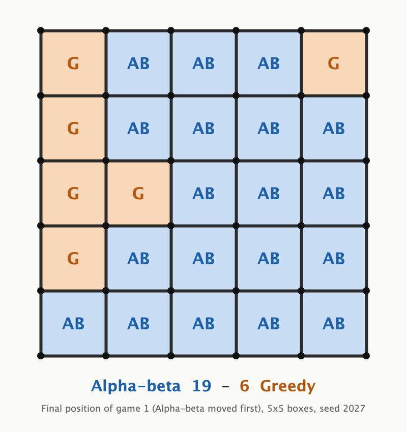

# dots-and-boxes-ai

Dots and Boxes agent: alpha-beta + PVS + Zobrist transposition table + chain-parity heuristic, plus a parallel MCTS. 1st of 8 teams, Symbolic AI course tournament, Université Paris-Saclay.



Built by a team of five for the Symbolic AI course tournament at Université Paris-Saclay (1st of 8 teams). This repository contains the agent code.

## Run it

Requires a JDK 17 or later, nothing else (run with Java 26; the sources also compile with Java 17).

```sh
./run.sh            # build, then alpha-beta vs Greedy, 2 games (about 1.5 min)
./run.sh bench      # the benchmark below, about 20 min; writes docs/benchmark.txt and docs/final-board.png
./run.sh alphabeta mcts --games 4 --mcts-ms 250    # any match-up: alphabeta | mcts | greedy | random
```

`run.sh` compiles `src/` with plain `javac` into `out/` and starts `arena.Arena`.

## Benchmark

Output of `./run.sh bench` on an Apple M4 (4 performance + 6 efficiency cores, 16 GB), Java 26, `-Xmx4g`. Raw log, game by game: [`docs/benchmark.txt`](docs/benchmark.txt). Total wall time: 21 min.

| A vs B | Games | A wins / draws / losses | Mean score difference for A (sd) |
|---|---:|---:|---:|
| Alpha-beta vs Random | 20 | 20 / 0 / 0 | +24.60 (1.05) |
| Alpha-beta vs Greedy | 20 | 20 / 0 / 0 | +13.50 (3.99) |
| Alpha-beta vs MCTS | 10 | 10 / 0 / 0 | +21.80 (2.70) |
| MCTS vs Greedy | 40 | 10 / 0 / 30 | −11.80 (10.44) |

Settings:

- 5×5 boxes (60 edges, 25 boxes). A moves first in odd-numbered games, B in even-numbered ones. Seed 2027 for the Random and Greedy players.
- **Alpha-beta** uses its own tournament clock, which is not a parameter: 1 s per edge, so 60 s per game, spread over its moves (see below). It used 46 to 51 s per game on average.
- **MCTS**: 250 ms per move, 10 threads (one per logical core), about 5 to 6 s per game.
- Alpha-beta vs Random and vs Greedy: 4 games played at once, one thread each. The two pairings involving MCTS: one game at a time, since MCTS uses every core.
- Why so few games: alpha-beta takes about 50 s per game because of its clock, so 100 games per pairing would take over an hour per pairing. The game counts above keep the whole run near 20 minutes. Search is time-bounded, so a rerun will not reproduce these games move for move.

Alpha-beta search statistics, read from the agent's public getters plus a node counter (see `src/arena`):

| | vs Random | vs Greedy | vs MCTS |
|---|---:|---:|---:|
| Moves searched to the end of the game | 455 of 830 | 438 of 739 | 247 of 407 |
| Completed depth when stopped by the clock (mean / median / min / max) | 7.7 / 6 / 5 / 26 | 7.8 / 6 / 5 / 30 | 8.6 / 6 / 5 / 28 |
| Completed depth on its first move of a game (mean) | 5.7 | 5.7 | 5.7 |
| Nodes per second | 660,810 | 626,875 | 982,781 |
| TT hit rate | 34.5% | 35.0% | 40.7% |

Depth counts moves that do not complete a box (captures do not use up depth). Nodes per second is lower in the first two columns, where 4 games ran at once. The TT hit rate is the table's own counter: hits divided by lookups, and the agent makes two lookups per interior node (one to probe, one to order moves).

MCTS loses to Greedy in 30 of 40 games at this budget. This benchmark does not isolate why. For reference, MCTS values a move by the win rate of greedy rollouts (wins, draws and losses, not box margins), while the alpha-beta evaluation models chains and parity directly; alpha-beta won every game it played here.

## How the agent works

### Why Dots and Boxes is a good test for search

- **Turns do not always alternate.** Completing a box gives you another move, so the textbook "MAX, MIN, MAX..." minimax is wrong: every node has to work out who moves next.
- **The endgame is combinatorial.** Games are decided by control of *chains* and *loops*. **Double-dealing** (deliberately leaving the last two boxes of a chain to keep control) is counter-intuitive: a greedy player that takes everything it can loses to a player that knows when to give.

### Alpha-beta with a transposition table (`src/alphabeta/`)

```
selectAction(board)
   │
   ├── per-game time budget, shared out move by move
   │
   └── iterative deepening (depth 1, 2, 3, ... until the clock runs out)
          │
          └── alpha-beta with:
                ├── PVS (principal variation search, null windows)
                ├── transposition table (64-bit Zobrist keys, EXACT / LOWER / UPPER flags)
                ├── move ordering (TT best move first, then 5 move categories)
                └── evaluation: chain / loop / parity heuristic
```

**Zobrist hashing** (`ZobristHash.java`). Every edge gets a fixed random 64-bit key; a position's key is the XOR of the keys of the drawn edges, XORed with a key for the side to move. The score difference is mixed in as well (multiplied by `0x9E3779B97F4A7C15`), because the same drawing with a different score is *not* the same position. The key is recomputed from scratch at every node (one pass over all edges); it is not updated incrementally.

**Transposition table** (`transpositionv2.java`, `TTEntry.java`). Stores `key → (value, depth, flag, best move)`. The flag says whether the value is exact or only a bound (from an alpha or a beta cut-off), so a stored bound can still narrow `[alpha, beta]`. Two tiers share each index: a depth-preferred slot (only replaced by an equal or deeper search) and an always-replace slot (the latest result). Size is 2^20 to 2^22 entries per tier, chosen from the JVM's maximum heap. The stored best move is tried first on the next visit, which is what makes iterative deepening pay off: inside the tree, the search at depth *n* orders the moves for depth *n+1*. The root itself is not reordered: it always tries its moves in the category order below, and its result is not stored in the table.

**PVS / null windows.** The first move (expected to be the best, thanks to move ordering) is searched with the full window. The others are first searched with a null window, `[alpha, alpha+1]` at the agent's own nodes and `[beta-1, beta]` at the opponent's: proving that a move is no better is cheaper than computing its exact value. If the result falls strictly inside `(alpha, beta)`, the move is searched again with the full window.

**Move ordering from game knowledge.** Before searching, moves are sorted into 5 categories:

| Priority | Category | Intuition |
|---|---|---|
| 1 | Completes 2 boxes | Largest immediate gain |
| 2 | Completes 1 box | Immediate gain |
| 3 | Neutral | Safe move |
| 4 | Gives 1 box (third side) | Possible sacrifice |
| 5 | Gives 2 boxes | Avoid unless forced |

**Non-alternating turns.** When a move completes a box, the same player moves again **and the depth is not decremented**: a run of captures counts as one logical move, so the search horizon does not collapse in the endgame.

**Game clock.** The agent manages one time budget for the whole game, 1 s per edge (60 s on a 5×5 board), and spends it as `time for this move = time left / (legal moves / 4 + 1)` (integer division), clamped to [50 ms, 15 s]. The budget is reset when the number of legal moves goes up, which is how the agent detects a new game. Iterative deepening stops before the clock only when its depth reaches the number of legal moves, that is, when it has searched to the end of the game.

**`undo()` through reflection.** The agent takes moves back in place instead of copying the board at every node. Its `undo()` clears the edge through the public edge arrays and resets the owners of the adjacent boxes by reading the engine's private `boxes` array through Java reflection. Not elegant, but it avoids a board copy per node.

### Evaluation (`heuristicv2.java`)

Called at every leaf, so it is a few linear passes over the boxes and the edges, with no recursion (it allocates a few small arrays per call):

- **Game phase**, the share of edges already drawn. Term weights depend on it; the raw score weighs more and more towards the end.
- **Chains and loops by union-find.** Undecided boxes with 2 or more sides drawn, joined through an undrawn shared edge, form the chains and loops that decide the endgame. A union-find (union by rank, path halving) groups them during the scan, without a separate recursive walk. The code counts a group as a long chain when it already has a box with 3 sides and at least 3 boxes, and any other group of 4 or more boxes as a loop.
- **Long-chain parity.** The number of safe moves left tells who will have to open the first long chain; the evaluation rewards the side for which the number of long chains and loops has the right parity: if it will open first, it wants an even number of them (a simplified version of the classic long-chain rule).
- **Double-dealing estimate.** Chain sizes are sorted and a net gain is estimated assuming the controlling player gives up 2 boxes on every chain but the last.
- **Capturable boxes**: groups that already contain a box with 3 sides count for the side to move and against the other.
- **Mobility**, weighted by move category, and penalties for boxes with 3 sides and for long chains.

### Parallel MCTS (`src/mcts/`)

Monte-Carlo tree search with **root parallelization**: one thread per logical core, each building its own UCT tree for the time budget; the root statistics are then merged and the most visited move is played.

- UCT selection (`c = 1.0`), expansion, rollout, backpropagation of win / draw / loss (not of the box margin).
- **Greedy rollouts**, not random ones: complete a box if possible, otherwise a random move that does not give a third side, otherwise a random move. A rollout stops early once one player holds a majority of the boxes.
- Each new node starts with 10 virtual visits at a win rate of about 50%. The code derives that rate from the current box count through `sigmoid(score / 3000)`, which stays between 0.500 and 0.502 for 0 to 25 boxes, so in practice it is a fixed smoothing prior, not game knowledge.
- Independent trees, so no locks during the search.

## The game engine in `src/engine`

The course engine (board, referee, tournament harness) belongs to the teaching team and is not redistributed. `src/engine` is a clean-room implementation of the public rules of Dots and Boxes, written so the agents can run outside the course infrastructure: a player who completes a box moves again, and the game ends when every edge is drawn. It exposes the API the agents call (`Board`, `Action`, `ActionStrategy`), including a private `boxes` array, because the agent's `undo()` reads it by reflection. The agents themselves are unchanged apart from their import lines and a few stray comments.

`src/baselines` holds the Random and Greedy opponents and `src/arena` the match runner, the PNG renderer and a subclass of the alpha-beta agent that only counts search nodes (it overrides the public recursive `alphaBetaTT` method to increment a counter and call the original).

## Layout

```
src/
├── alphabeta/                    the tournament agent
│   ├── AlphaBetaTTStrategy.java  search: iterative deepening + PVS + TT + clock
│   ├── heuristicv2.java          evaluation: phase, union-find, chains / loops
│   ├── ZobristHash.java          64-bit Zobrist keys
│   ├── transpositionv2.java      two-tier transposition table
│   ├── TTEntry.java              TT entry (value, depth, flag, best move)
│   └── TimeOutException.java     stops the search when the clock runs out
├── mcts/
│   └── ParallelMCTSStrategy.java root-parallel MCTS (UCT + thread pool)
├── engine/                       clean-room rules engine (Board, Action, ActionStrategy)
├── baselines/                    Random and Greedy players
└── arena/                        Arena (match runner), BoardImage (PNG), InstrumentedAlphaBeta
```
